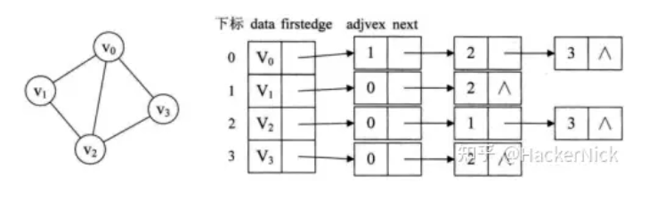

# 总结
- 求点A到点B的全局最短路径
- 邻接表 算法复杂度为O(n^2)
- 基于广度搜索的思想，搜索到某一个顶点后，更新与其相邻顶点的权重。顶点权重的数据含义表示从起始点到此点的最短路径长度（也就是经过的所有边的权重之和）。

# 存储结构
### 邻接矩阵
- 就是二维数组，graph[i][j] == graph[j][i] (无向图)
- 如果i，j之间无边，则graph[i][j] = INF;
- 特点：空间复杂度为O(V^2)，适合稠密图的存储。
~~~
    同时还需要维护两个数组：
    cost数组：cost[i] 代表start point到顶点i的距离值。
    used数组，一旦确定start point 到该点的距离更新完成，在used数组中将该位置置1，代表着该点已经完成最短路径的更新，下次不考虑该位置。
~~~

### 邻接表 + 优先队列 （这个代码还没看）

- 对于有权值的图，可以使用如下结构体存储，空间复杂度为O(V + E)
- 使用优先队列进行存储，替代cost数组
~~~
    typedef struct Arcnode       //边
    {
        int adjvex;              //邻接点在数组中的位置下标
        struct Arcnode *nextarc; //指向下一个邻接点的指针
        int weight;              //权值
    }Arcnode;
    
    typedef struct Vnode         //顶点
    {
        int data;                //顶点的数据域
        Arcnode *firstarc;       //指向邻接点的指针
    }Vnode,AdjList[MAXN];        //存储各链表头结点的数组
    
    typedef struct Graph
    {
        AdjList vexlist;         //图中顶点的数组
        int vexnum,arcnum;       //记录图中顶点数和边或弧数
    };
~~~

- 注意：关于为什么最外层fori循环的存在：因为要找到其他所有未被访问的点到所有已经访问了的点的最小距离距离。